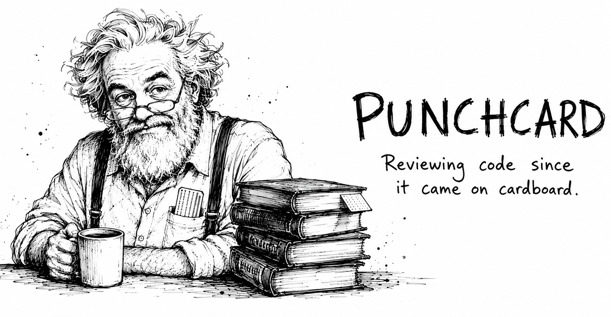

<p align="center">
  <picture>
    <source media="(prefers-color-scheme: dark)" srcset="assets/banner-dark.png">
    
  </picture>
</p>

<p align="center"><em>"There are two ways of constructing a software design: one way is to make it so simple that there are obviously no deficiencies, and the other way is to make it so complicated that there are no obvious deficiencies."</em><br>— C. A. R. Hoare, Turing Award lecture, 1980</p>

<p align="center">Architecture-level code review <strong>for any coding agent</strong>.<br>
Three independent searches, one verdict, every blocker demonstrated by running the code.<br><br>
<strong>Measured against Claude Code's built-in <code>/code-review</code> on the same PRs: the same blockers, plus the design class it never sees — and not one nitpick.</strong></p>

---

Point Punchcard at a working tree, a branch or a pull request and he reads it
the way the veteran who started on punch cards does: module boundaries,
dependency direction, the data model, the error paths, the cost of the next
change — never your variable names. Back comes one verdict, a summary table
and one card per finding, inside whatever coding agent you already work in.

## What he read

<p align="center">
  
</p>

Fifty years of the industry's best thinking, read cover to cover: thirty
books, five shelves, no others. Distilled into 349 principles, then into the
78 that decide a review. Every finding cites one — so he argues from the
canon, never from mood.

- **I. The engineering canon** — Ousterhout, McConnell, Thomas & Hunt, Kernighan & Pike, Fowler, Feathers, Farley, Winters, Seemann, Hermans, Martin, the Gang of Four
- **II. Local design and responsibilities** — Beck, Wirfs-Brock & McKean, Evans, Fowler, Martin, Fairbanks
- **III. Architecture, change, technical debt** — Richards & Ford, Ford & Sadalage & Dehghani, Parsons & Kua, Tornhill, Spinellis
- **IV. Tests as proof of behavior** — Beck, Freeman & Pryce, Khorikov
- **V. Data, production, reliability, security** — Kleppmann, Nygard, Adkins et al., Johnsson & Deogun & Sawano

The shelf with ISBNs is [`CORPUS.md`](CORPUS.md); the distillations are in
[`corpus/distillates/`](corpus/distillates/), the decided forks in
[`corpus/conflicts.md`](corpus/conflicts.md), the constitution itself in
[`skills/punchcard/constitution/`](skills/punchcard/constitution/).

<details>
<summary><strong>One trace: book → principle → verdict</strong></summary>

Principle **1.4**, "Treat duplicated knowledge as a defect on sight", closes
with the line that makes it accountable:

```
**Sources:** (01, 02, 05, 13, 14, 18; F3)
```

That is Ousterhout, McConnell, Fowler's *Refactoring*, Beck's
*Implementation Patterns*, Wirfs-Brock & McKean and Fairbanks, plus fork
**F3** — "What makes duplication a finding" — where their disagreement was
decided rather than averaged.

On psf/requests#7520 that principle is finding #2 in the demo below: the
quoted-string scanner now exists twice, so the blocker in #1 has to be fixed
twice. The [stability benchmark](benchmarks/stability-2026-08.md) records it as
*quote rule duplicated*, **5/5** cold runs — `/code-review` never reported it.

</details>

## How it reviews

Search and judgement are different jobs, so they run in different places.
Three finders read the same diff independently and return candidates, not
findings:

| Pass | Reads the diff as | Returns |
|---|---|---|
| 1 | every changed value, traced to its last consumer — inside the repository and inside the packages it calls | where the value lands wrong |
| 2 | every guarantee a deleted line used to make | the place the new code makes it again, or doesn't |
| 3 | every changed behavior | the test that goes red when it is reverted, or the missing case |

One judge then holds the candidates against the constitution, runs `main` and
the PR on the input that matters, and renders what survives: verdict, summary
table, one card per finding. The [stability benchmark](benchmarks/stability-2026-08.md)
shows what each of those decisions bought and what it cost.

## See it

<p align="center">
  
</p>

> A real review of [psf/requests#7520](https://github.com/psf/requests/pull/7520) — [the full text](assets/demo-review.md), as the skill rendered it.

## The verdicts

| Verdict | Meaning |
|---|---|
| 🟢 **Ship it.** | Nothing passed the gate. Merge, and here is what was verified. |
| 🟡 **Ship with care.** | Mergeable as is; the findings are worth closing, ideally in this PR. |
| 🟠 **Ship after #1…#N.** | The numbered findings are mandatory before merge; the rest can follow. |
| 🔴 **Wrong shape. Talk before more code.** | The design doesn't fit the problem. Stop. |

The verdict is followed by one sentence saying what to do right now, then a
summary table, then the findings. A finding looks like this:

---

### 🔴 2 · Charge failures vanish silently

`billing/api.py:48` · A failed charge leaves the order marked paid, and
nobody learns until month-end reconciliation.

The diff swallows every exception from the charge call, in `submit_order` at
`billing/api.py:48`:

```python
try:
    charge(order.total)
except Exception:
    pass          # ← a declined card is indistinguishable from a paid one
```

The order is then marked paid unconditionally, two lines later at
`billing/api.py:52`:

```python
order.status = "paid"
```

> 🔧 **Fix:** let the charge failure reach the caller — the endpoint's error
> handler already returns 502 and leaves the order unpaid.

---

## Install

```
npx skills add Maksim-Burtsev/punchcard
```

Any agent: this installs the skill into every harness it finds on the
machine. Everything below is the same skill, installed by hand.

<details>
<summary><strong>Claude Code</strong> — as a plugin, with <code>/punchcard</code> and <code>/punchcard:pr</code></summary>

```
/plugin marketplace add Maksim-Burtsev/punchcard
/plugin install punchcard@punchcard   # plugin@marketplace
```

Or load it for one session without installing:

```
claude --plugin-dir path/to/punchcard
```

</details>

<details>
<summary><strong>Codex · Cursor · Gemini CLI · Copilot · OpenCode · Amp · Zed · Cline · Pi</strong></summary>

```
npx skills add Maksim-Burtsev/punchcard -a codex     # or cursor, gemini-cli, copilot, …
```

Or drop it in by hand — the skill is one self-contained directory:

```
cp -r skills/punchcard .agents/skills/
```

Invoke it as `$punchcard <target>` in Codex, `/punchcard <target>`
elsewhere; add the word `post` next to the target to have the review posted
into the PR/MR.

</details>

<details>
<summary><strong>Kiro · Windsurf · Goose · Droid · Hermes · Junie</strong></summary>

```
npx skills add Maksim-Burtsev/punchcard -a <agent>
```

</details>

<details>
<summary><strong>Aider</strong></summary>

```
/read-only skills/punchcard/SKILL.md
```

</details>

Where the harness has no subagents, the three passes run one after another
in the same session — the same review, only slower.

## Use

```
/punchcard                  # review working tree, or current branch vs default
/punchcard main..feature    # review a range
/punchcard <MR/PR url>      # review a PR/MR, render in the conversation
/punchcard:pr <url|number>  # review a PR/MR and post the review into it
```

The slash form is how Claude Code names a skill. Codex spells it
`$punchcard <target>`, and every other harness has its own way in — asking for
a Punchcard review of the target in plain words works everywhere. Where there
is no `:pr` command, put the word `post` next to the target instead.

Posting puts one PR review on GitHub (locations permalinked to the reviewed sha,
which GitHub expands into code cards) or one MR note on GitLab. Re-run it after a
push and it updates that same review in place — one entry per PR, for the life of
the PR. No access to post? The review is rendered in the reply, with the reason.

<details>
<summary><strong>In CI</strong> — GitHub Actions and GitLab CI</summary>

A fresh runner has nothing installed, so load Punchcard explicitly from a
checkout of this repository — below with `--plugin-dir`, in another harness
with whatever it reads skills from.

GitHub Actions, review every PR ([claude-code-action](https://github.com/anthropics/claude-code-action)):

```yaml
permissions:
  pull-requests: write   # note: fork PRs get a read-only token
steps:
  - uses: actions/checkout@v4
  - uses: actions/checkout@v4
    with:
      repository: Maksim-Burtsev/punchcard
      path: .punchcard
  - uses: anthropics/claude-code-action@v1
    with:
      anthropic_api_key: ${{ secrets.ANTHROPIC_API_KEY }}
      prompt: "/punchcard:pr ${{ github.event.pull_request.html_url }}"
      claude_args: '--plugin-dir ./.punchcard --allowedTools "Bash(gh:*),Bash(git:*),Read,Grep,Glob"'
```

GitLab CI:

```yaml
punchcard:
  script:
    - git clone --depth 1 https://github.com/Maksim-Burtsev/punchcard /tmp/punchcard
    - claude -p "/punchcard:pr $CI_MERGE_REQUEST_IID" \
        --plugin-dir /tmp/punchcard \
        --allowedTools "Bash(glab:*),Bash(git:*),Read,Grep,Glob"
  variables:
    GITLAB_TOKEN: $CI_JOB_TOKEN
```

</details>

## Measured

Every claim above was checked on real open-source pull requests, with the
per-run reviews matched to a hand-verified list of defects and every factual
claim re-executed against the code.

| Report | What it shows | Headline number |
|---|---|---|
| [Calibration](benchmarks/calibration-2026-08.md) | six PRs, four systematic faults found in the reviewer and fixed | the first clean "Ship it." |
| [Stability](benchmarks/stability-2026-08.md) | cold runs on two PRs plus a clean control, every edit measured before it stayed; Go, JS, Rust and Java smoke runs | every blocker-class finding stable, zero noise, the dependency-deep miss taken 3/3 |
| [With and without](benchmarks/with-without-2026-08.md) | the same four PRs by the bare model, by Punchcard, and by `/code-review`, three cold runs each | zero below-altitude noise against 2.3 nit sections per bare review, reviews 37% shorter |

Known trade-off, chosen on purpose: a review costs roughly 1.5–2× the tokens
of a bare prompt and runs about twice as long as `/code-review`, because every
claim is demonstrated by actually running both trees.

## Keeping it in the loop

There is no hook and no daemon: you decide when a change deserves the
reviewer. The cheapest way to make that automatic for the agents
working in a repository is to say so in `AGENTS.md` or `CLAUDE.md`:

```markdown
Before opening a pull request, run the punchcard skill on the branch and
fix every BLOCKER it reports.
```

## Punchcard and friends

A bug hunter and Punchcard look for different defects. Claude Code's
`/code-review`, the one the benchmarks measure against, hunts runtime bugs;
Punchcard judges the shape of the change. On the same four PRs it saw nothing
of the duplicated-knowledge, single-source and wrong-seam-test findings
Punchcard reported every run — so run both, whatever your harness calls its
bug reviewer. And
[Ponytail](https://github.com/DietrichGebert/ponytail) governs what you build.

## License

MIT
